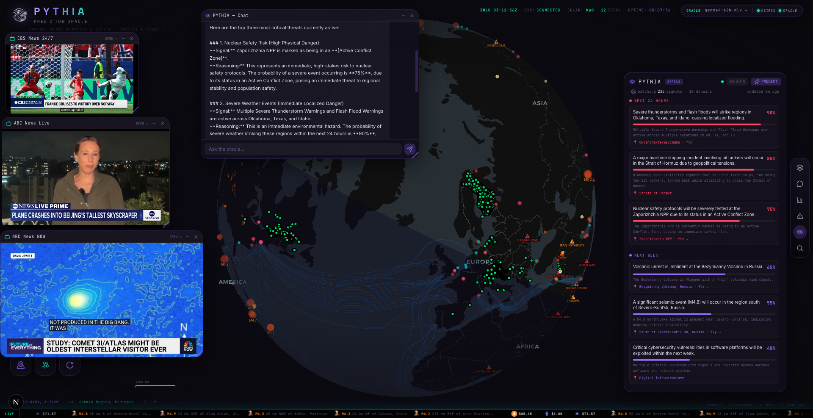

<div align="center">

# 🔮 PYTHIA

### Watch the world. Predict what happens next.

PYTHIA fuses two open-source projects — **[MiroFish](https://github.com/666ghj/MiroFish)**, a swarm-intelligence prediction engine, and **[Osiris](https://github.com/simplifaisoul/osiris)**, a live global-intelligence globe — into a single machine that ingests everything happening on Earth in real time and forecasts the future across the next **24 hours, week, month, and year**.

It runs **entirely on your own hardware**. No cloud, no API keys, no cost.



</div>

---

## The idea

The world broadcasts its future constantly — in the news, in conflict movements, in seismographs, storms, cyber chatter, and the bets people place. The problem has never been a lack of signal; it's that no one can watch all of it at once and reason across it.

PYTHIA does. It is an **oracle**: a single surface that takes in the entire live state of the planet and tells you, plainly, what is most likely to happen and where — with a probability and the reasoning behind it.

- **Osiris** is the *eyes* — a real-time globe streaming 30+ live feeds.
- **MiroFish** is the *mind* — a prediction engine that models how the world reacts to events.
- A **local LLM** is the *voice* — it reads the assembled world-state and speaks the forecast.

```
            OSIRIS  ──── live world feeds ────►   PYTHIA ENGINE   ──── world brief ────►   MiroFish / local LLM
        (the live globe)                          (fusion + API)                              (the oracle)
   news · conflict · weather · seismic                  │                                          │
   cyber · infrastructure · market odds                 ▼                                          ▼
                                              predictions · chat · map overlays  ◄──── forecasts (24h · week · month · year)
```

## Built on MiroFish + Osiris

**[MiroFish](https://github.com/666ghj/MiroFish)** — *a simple, universal swarm-intelligence engine for predicting anything.* MiroFish builds a high-fidelity parallel world of autonomous agents that react to seed events and simulates how the situation unfolds. PYTHIA is built around MiroFish's prediction-engine model: it uses MiroFish's configured model as the oracle and is designed to drive MiroFish's full multi-agent OASIS swarm when a [Zep](https://www.getzep.com/) memory key is configured. Out of the box, PYTHIA runs the same model locally for instant, free forecasts.

**[Osiris](https://github.com/simplifaisoul/osiris)** — *a real-time global intelligence dashboard.* Osiris provides the live 3D globe and the feed layer PYTHIA watches: breaking news, GDELT geopolitics, armed conflict, NWS storm/flood warning zones, EONET disasters, wildfires, earthquakes, cyber threats, critical infrastructure, and more — plus **Polymarket** crowd probabilities as forecasting anchors.

## What PYTHIA does

- **Forecasts the future** from the live world, grouped by horizon, each prediction carrying a probability, its reasoning, and a location — **click one and the globe flies there.**
- **Answers questions** — a chat that can see *every* live source and its own forecasts at once.
- **Surfaces risk on the map** — overlays like live storm/flood warning zones drawn as outlined areas.
- **Is a cockpit, not a page** — pull up news feeds and chat as movable, resizable windows around a spinning globe, and watch the world go on.
- **Picks its own brain** — switch between any model installed in [Ollama](https://ollama.com) from the UI.

## Quickstart

**Requirements:** [Ollama](https://ollama.com) with a model pulled (`ollama pull llama3.1`), a checkout of [Osiris](https://github.com/simplifaisoul/osiris) with the overlay applied (`integrations/osiris/INSTALL.md`), and Python 3.11+ with [uv](https://docs.astral.sh/uv/).

```bash
cp .env.example .env     # sensible defaults; no keys needed
./run-all.sh             # starts the globe (:3000) + the engine (:8088) and opens it
```

…or double-click **`PYTHIA.app`** on macOS. Then open the oracle deck (the Eye) and press **PREDICT**.

## Architecture

| Part | Role |
|---|---|
| `engine/` | The PYTHIA oracle — FastAPI. Pulls + fuses every feed (`osiris_intake`, `world_state`), runs the forecast and chat (`oracle`), serves the API (`server`). |
| `integrations/osiris/` | The overlay applied to an Osiris checkout — the predictions deck, chat, floating windows, map overlays, and API routes. See its `INSTALL.md`. |
| `run-all.sh` · `PYTHIA.app` | One-tap launchers. |

**Engine API** (`:8088`): `/predict` · `/predictions` · `/chat` · `/world` · `/state` (+ SSE) · `/models` · `/model` · `/loop` · `/links` · `/health`

## Configuration (`.env`)

Time horizons, predictions per horizon, refresh cadence, and the model are all configurable. Leave the `LLM_*` lines blank to reuse MiroFish's configured local model, or set `LLM_MODEL=llama3.1`.

## Credits

PYTHIA stands entirely on the work of these projects — please star them:

- **[MiroFish](https://github.com/666ghj/MiroFish)** by [@666ghj](https://github.com/666ghj) — the swarm-intelligence prediction engine.
- **[Osiris](https://github.com/simplifaisoul/osiris)** by [@simplifaisoul](https://github.com/simplifaisoul) — the live intelligence globe.
- **[Ollama](https://ollama.com)** — local LLM runtime.

Osiris and MiroFish are *not* redistributed here; PYTHIA is the engine plus an overlay you apply to your own checkouts.

## License

[MIT](LICENSE).
